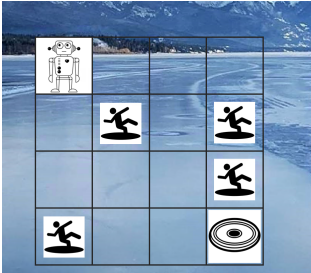
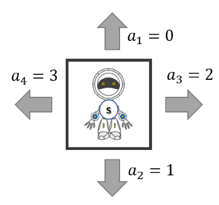
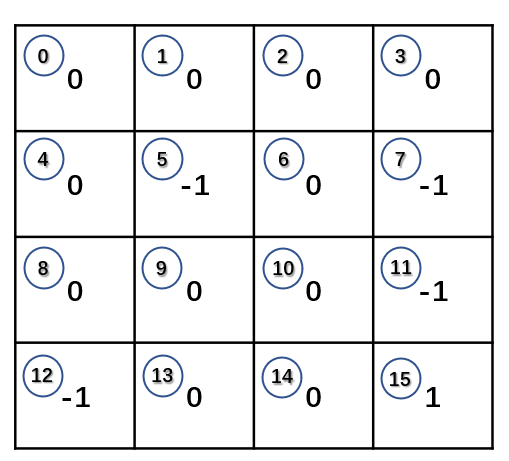
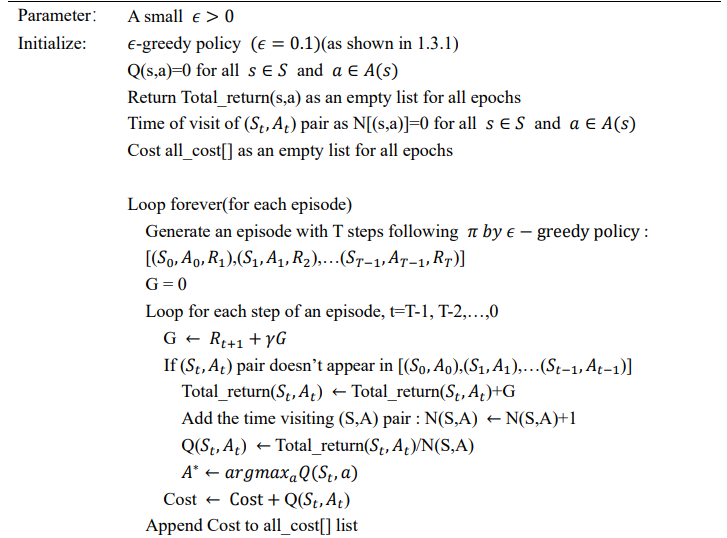
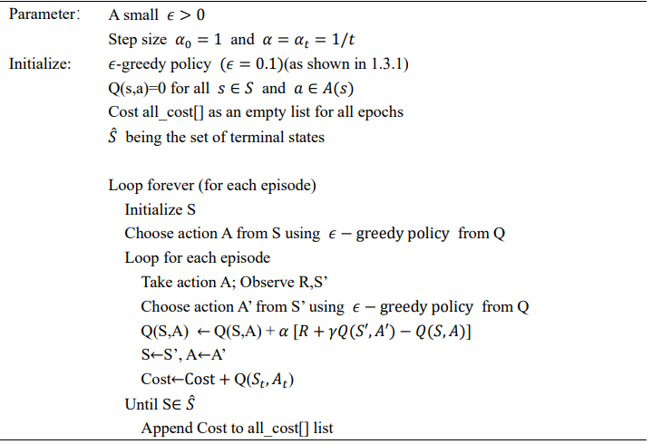
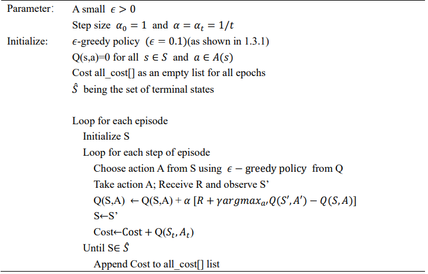

## Introduction
The robot intended to go through the frozen lake from one location (top left corner) to another (bottom right corner). However, there are four holes on the ice and if the robot steps into each of them, the task fails. 

* Reward and action initialization

## Dependencies
* This repo depends on the following standard ROS pkgs:
  * `numpy`
  * `matplotlib`
  * `tkinter`
  * `math`
  * `argparse`
  * `PIL`
## Files
* `Q table` includes the results of Q table
	  * `4*4` : Q table of the 4*4 environment of three algorithms
	  * `10*10` : Q table of the 10*10 environment of three algorithms

* `Environment.py`  Build the environment
* `Parameters.py`  Set the parameters
* `Monte_Carlo_control.py`  Perform Monte Carlo algorithm
* `Q_learning`  Perform Q learning algorithm
* `SARSA`  Perform SARSA algorithm
* `train.py`  The main file to run all the algorithm by the input (can change the default value to get the results as expected)
* `test.py`  Run the three algorithms simutaneously and get the figure for analysis

## Implement first-visit Monte Carlo without exploring starts

Problems and improvement of finding optimal policy in 10*10 grid

### Always exploring in a small area in 10000 episodes
* Increasing learning episode and maximum steps of an episode
* Give higher penalty of a trap and higher reward of the target.
* Change the value of epsilon in greedy behavior policy. 

### Always trapped at the same point
* Give a penalty to the agent if it reaches the same trap.

We initialize a list to record the time of the ending (state, action) pair and give the penalty of -1*times to the agent. The more times the agent visit this trap, the more penalty it will receive. Then the effect is clear that the agent can explore more different areas and the ending at different state.

### Always stay in the same state
* Give a penalty if the agent (state,action)(t) = (state,action)(t+1)

For the loop of each step in an episode, we check whether the (state, action) is same as the last step. we give a penalty -3. Then the agent will explore more different states in other area.

### Always move back and forth
* Give rewards when the agent moves down or right. 

The start state of an agent is fixed at left top and the target state is at right bottom point. If the agent moves right or down, it will get closer to the target, then we will give a reward to the agent with 4. The result shows that the agent can explore more space and have less action to go back.

## Implement SARSA

###	Fail to find the optimal policy in 10*10 grid of SARSA algorithm
Modify the reward function. The reward function is a critical component of the reinforcement learning problem. If we use the same model of 4*4 grid to do the task in 10*10 grid, only the Q-learning algorithm can converge to the optimal policy. The Monte-Carlo and SARSA algorithms can not get the optimal policy over 50000 episodes. Then we change the reward of (state, action) pair when reaching the target to be 5. Then we can get the optimal policy. 
## Implement Q-learning

## Reference
This code gave me a lot of instruction and the Github page is https://github.com/zhangyifengdavid.

